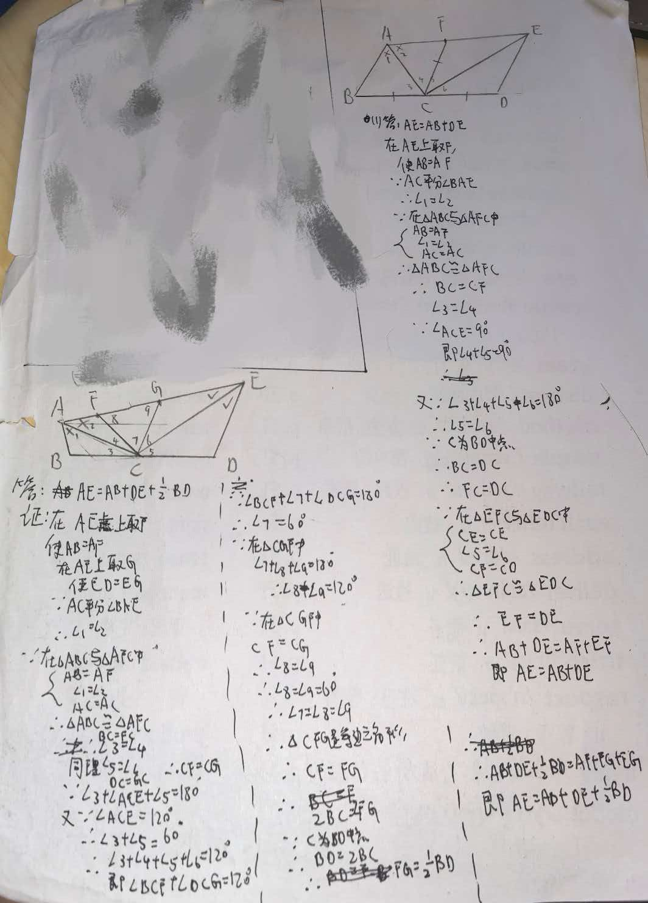

# 七年级几何难题精选

## 题目：四边形与角平分线模型

【背景】
在四边形 ABDE 中，C 是 BD 边的中点。

【问题】
（1）如图（1），若 AC 平分∠BAE，∠ACE＝90°，则线段 AE、AB、DE 的长度满足的数量关系为$\underline{\quad\quad\quad\quad\quad\quad}$；（直接写出答案）

（2）如图（2），AC 平分∠BAE，EC 平分∠AED，若∠ACE＝120°，则线段 AB、BD、DE、AE 的长度满足怎样的数量关系？写出结论并证明；

