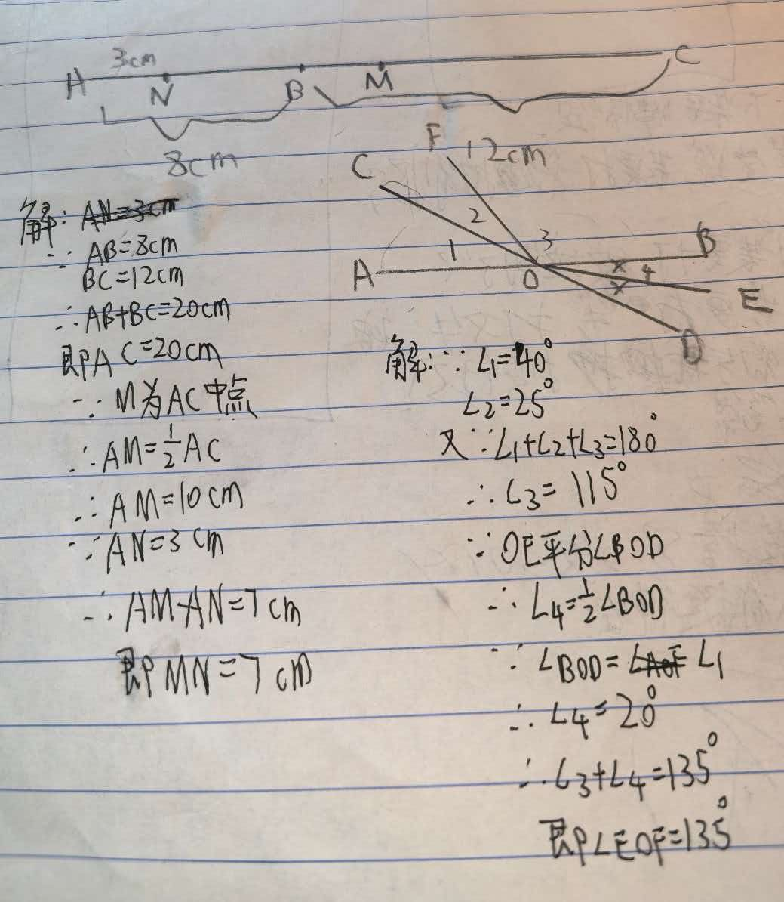

# 七年级几何难题精选

## 题目1：线段中点计算

【背景】
已知点A、B、C在同一条直线上，且点B在点A与点C之间。线段AB的长度为8cm，线段BC的长度为12cm。点M是线段AC的中点，点N是线段AB上的一点，且AN = 3cm。

【问题】
求线段MN的长度。

---

## 题目二：角度计算

【背景】
如图，直线AB与直线CD相交于点O，∠AOC = 40°。射线OE平分∠BOD，射线OF在∠COB内部，且∠COF = 25°。

【问题】
求∠EOF的度数。
