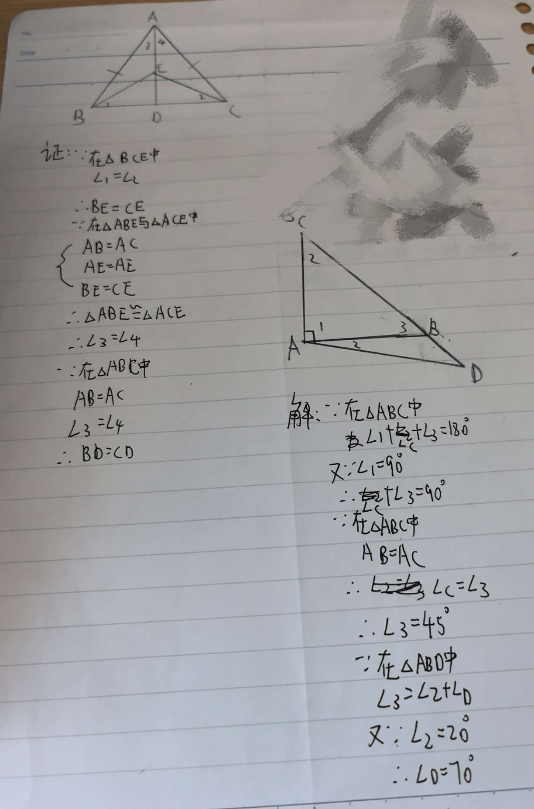

# 七年级几何难题精选

## 题目一：等腰三角形与角度模型

【背景】
在△ABC中，AB = AC，D是BC上一点，E是AD延长线上一点，且∠EBD = ∠ECD。

【问题】
求证：BD = CD。
---

## 题目二：中线与等腰三角形模型

【背景】
在△ABC中，AD是BC边上的中线，E是AD上一点，BE = AC，延长BE到F使EF = BE。

【问题】
求证：AF = AC。

