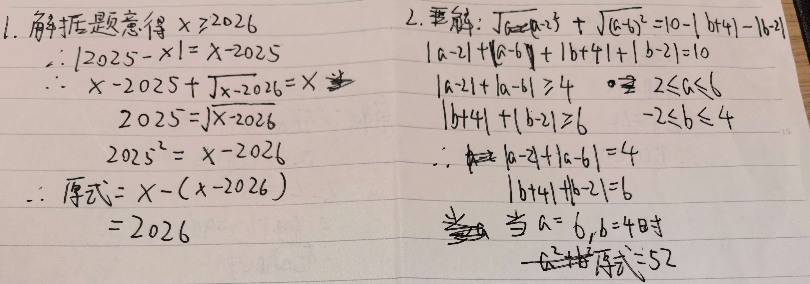

# 七年级数学竞赛题精选

## 题目一：绝对值与根式

【背景】
已知 $x$ 满足 $|2025 - x| + \sqrt{x - 2026} = x$。

【问题】
求 $x - 2025^2$ 的值。

---

## 题目二：最值问题

【背景】
实数 $a$、$b$ 满足 $\sqrt{a^2 - 4a + 4} + \sqrt{36 - 12a + a^2} = 10 - |b + 4| - |b - 2|$。

【问题】
则 $a^2 + b^2$ 的最大值为 ______。
