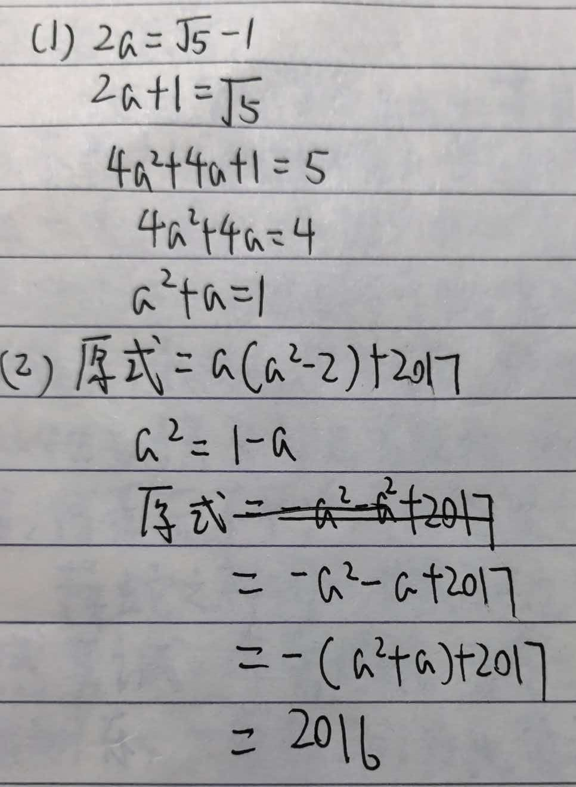

# 七年级数学竞赛题精选

## 题目：利用平方根去根号构造整系数方程

【背景】
利用平方根去根号可以用一个无理数构造一个整系数方程。

例如：$a = \sqrt{2} + 1$，移项得 $a - 1 = \sqrt{2}$，两边平方得 $(a-1)^2 = (\sqrt{2})^2$，
$\therefore a^2 - 2a + 1 = 2$，即 $a^2 - 2a - 1 = 0$。

【问题】
仿照上述方法完成：已知 $a = \dfrac{\sqrt{5} - 1}{2}$，

（1）求 $a^2 + a$ 的值；

（2）求 $a^3 - 2a + 2017$ 的值。
