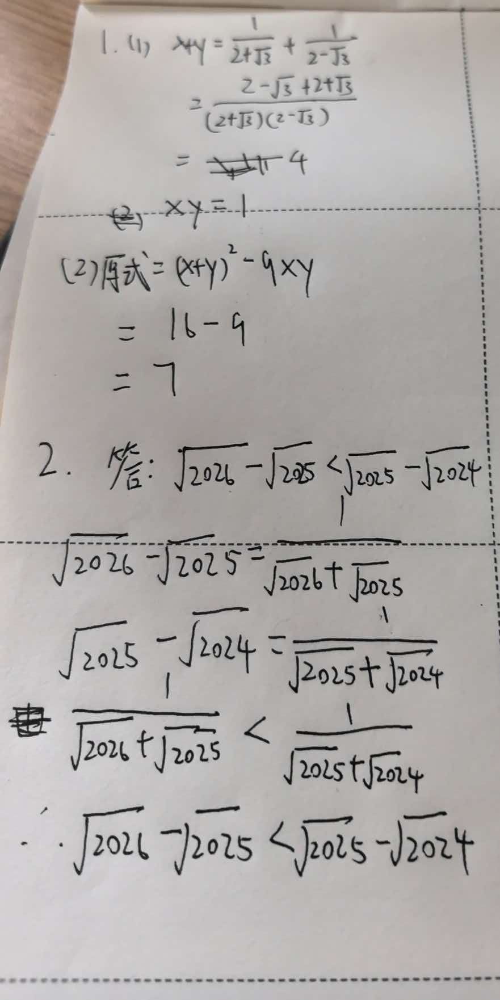

# 七年级数学竞赛题精选

## 题目一：分母有理化与整体代入求值

【背景】
分母有理化是化简二次根式的重要方法，通过将分母中的根号去掉，可以将复杂的根式化为更简洁的形式。

例如：$\dfrac{1}{\sqrt{2}+1} = \dfrac{\sqrt{2}-1}{(\sqrt{2}+1)(\sqrt{2}-1)} = \dfrac{\sqrt{2}-1}{2-1} = \sqrt{2}-1$。

【问题】
已知 $x = \dfrac{1}{2+\sqrt{3}}$，$y = \dfrac{1}{2-\sqrt{3}}$，

（1）求 $x + y$ 和 $xy$ 的值；

（2）求 $x^2 + y^2 - 5xy$ 的值。

---

## 题目二：二次根式比较大小

【背景】
比较两个含有二次根式的数的大小，常采用"分子有理化"的方法，即将分子中的根号去掉，转化为比较分母的大小。

例如：比较 $\sqrt{3}-\sqrt{2}$ 与 $\sqrt{2}-1$ 的大小，
可将两者分别分子有理化：$\sqrt{3}-\sqrt{2} = \dfrac{1}{\sqrt{3}+\sqrt{2}}$，$\sqrt{2}-1 = \dfrac{1}{\sqrt{2}+1}$。
由 $\sqrt{3}+\sqrt{2} > \sqrt{2}+1$，得 $\dfrac{1}{\sqrt{3}+\sqrt{2}} < \dfrac{1}{\sqrt{2}+1}$，
即 $\sqrt{3}-\sqrt{2} < \sqrt{2}-1$。

【问题】
比较 $\sqrt{2026}-\sqrt{2025}$ 与 $\sqrt{2025}-\sqrt{2024}$ 的大小，并说明理由。
