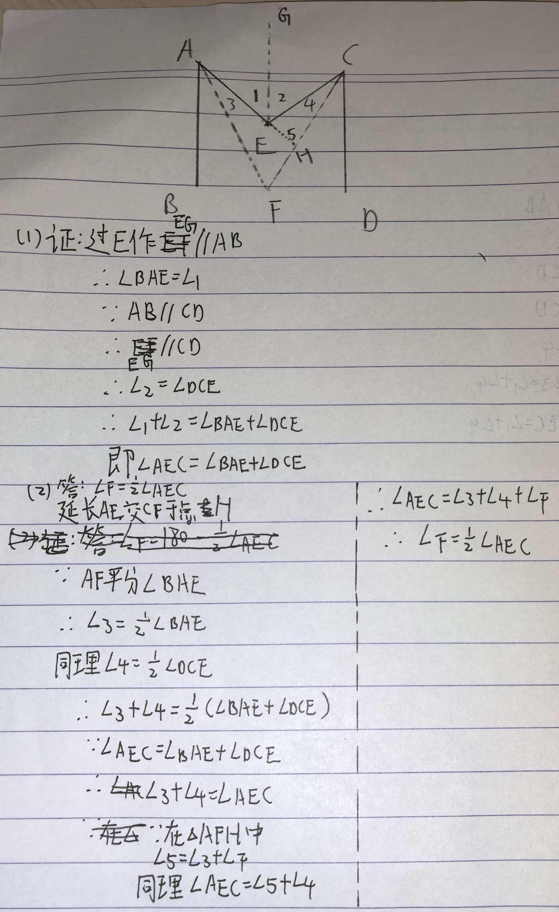
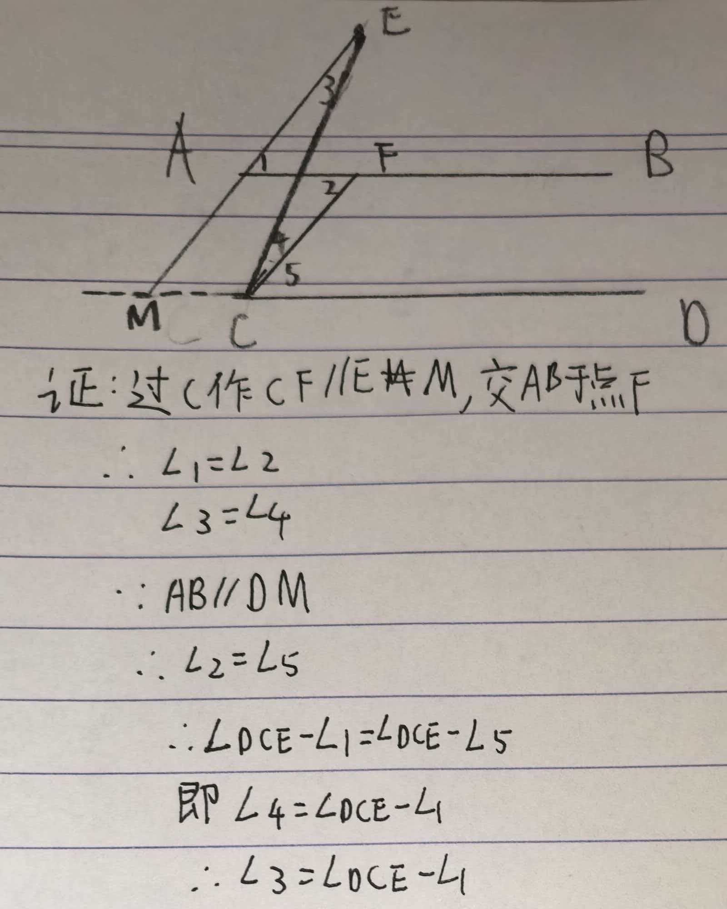

# Daily-Maths-practice

## 题目一：

平行线中的“猪蹄模型”（M型）探究

【图形描述】已知直线  AB∥CD，点  E 是位于直线  AB 和  CD 之间的一个点。连接  AE 和  CE，构成一个类似字母“M”的折线图形。

【问题】

（基础证明） 请证明： ∠AEC=∠BAE+∠DCE。

（变式探究） 若将上述图形中的  ∠BAE 和  ∠DCE 的角平分线分别记为射线  AF 和射线  CF，且这两条角平分线相交于点  F（点  F 同样在  AB 与  CD 之间）。请探究  ∠AFC 与  ∠AEC 之间的数量关系，并给出证明。

## 题目二：

平行线中的“牛角模型”（单拐点）探究

【图形描述】已知直线  AB∥CD，点  E 是直线  AB 上方（即不在两平行线之间）的一个点。连接  AE 交直线  CD 于点  M，连接  CE。此时， ∠A（即  ∠BAE）、 ∠C（即  ∠DCE）与  ∠AEC 构成了一个类似“牛角”的形状。

【问题】

（证明） 请证明： ∠AEC=∠DCE-∠BAE。

