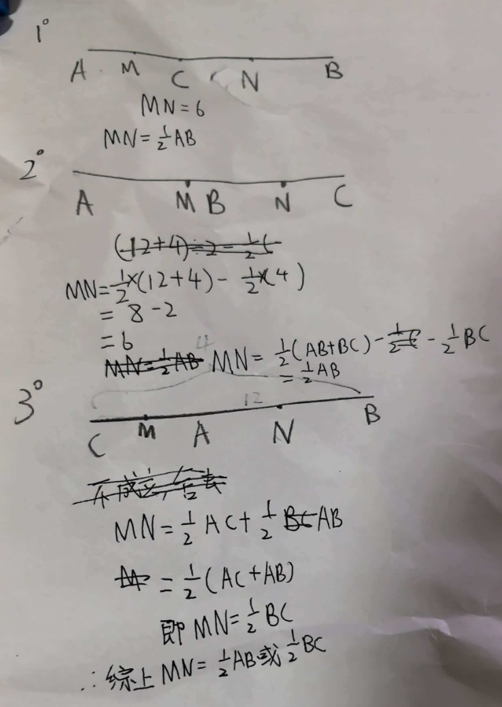

七年级几何难题精选
题目一：动点与线段中点的"陷阱"
【背景】
已知线段  AB=12，点  C 是直线  AB 上的一个动点（注意：是直线，不仅仅是线段），点  M、 N 分别是线段  AC、 BC 的中点。
【问题】
	当点  C 在线段  AB 上，且  AC=4 时，求  MN 的长。
	当点  C 运动到线段  AB 的延长线上（点  B 右侧），且  BC=4 时，求  MN 的长。
	（核心难点） 无论点  C 在直线  AB 上的什么位置，线段  MN 的长度是否始终为一个定值？如果是，请给出证明；如果不是，请说明理由并求出所有可能的  MN 长度。

