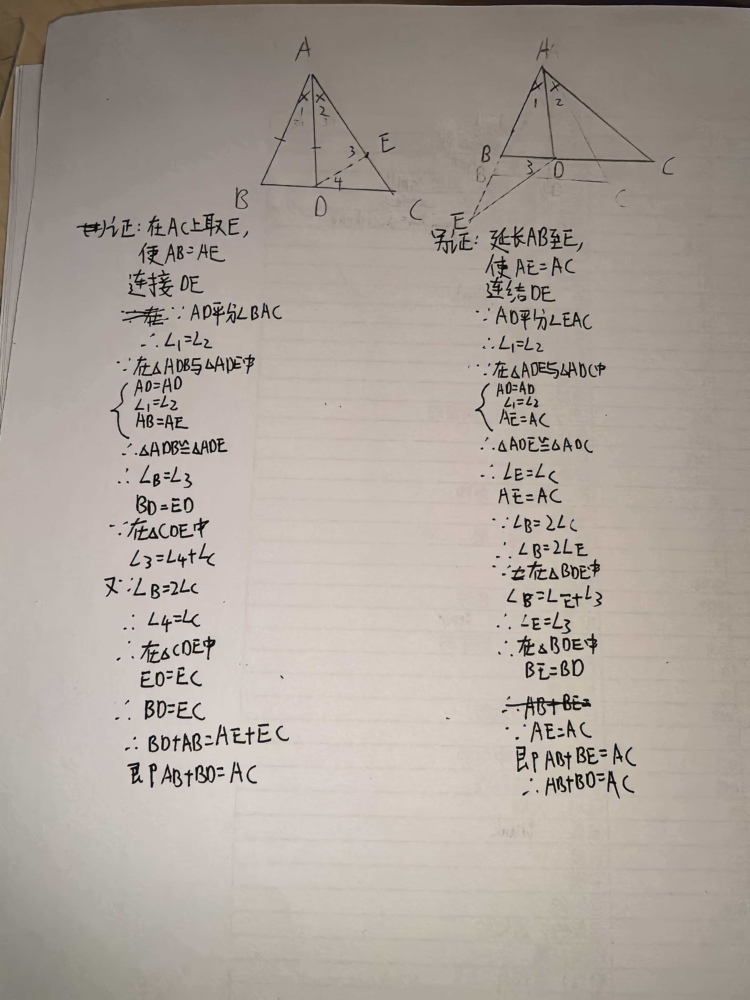
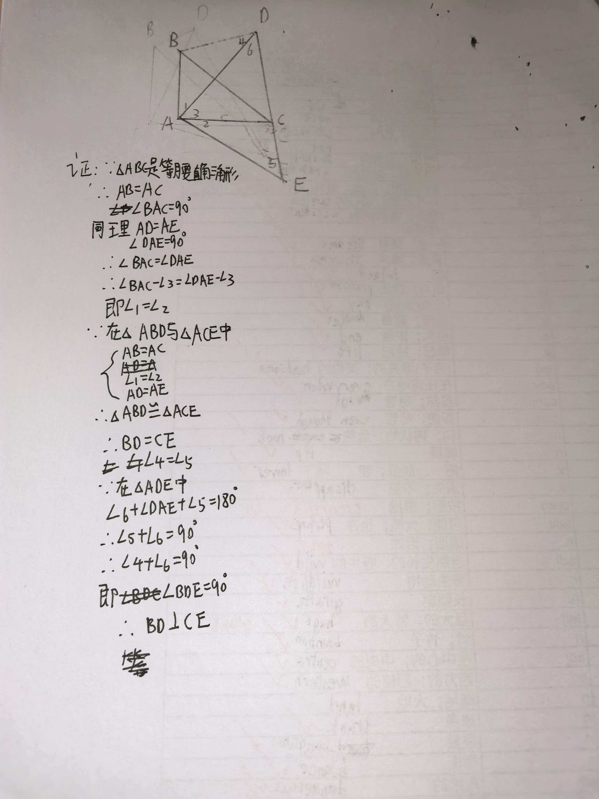

# 七年级几何难题精选
题目一：角平分线模型
【背景】
已知：在△ABC中，AD平分∠BAC，∠C = 2∠B。

【问题】
（1）求证：AB = AC + CD。

（2）如图，在△ABC中，AD平分∠BAC，且AB = AC + CD，求证：∠C = 2∠B。

---

题目二：手拉手模型（旋转全等）
【背景】
已知：△ABC和△ADE都是等腰直角三角形，∠BAC = ∠DAE = 90°，且点A为公共顶点。连接BD、CE。

【问题】
求证：BD = CE，且BD ⊥ CE。

