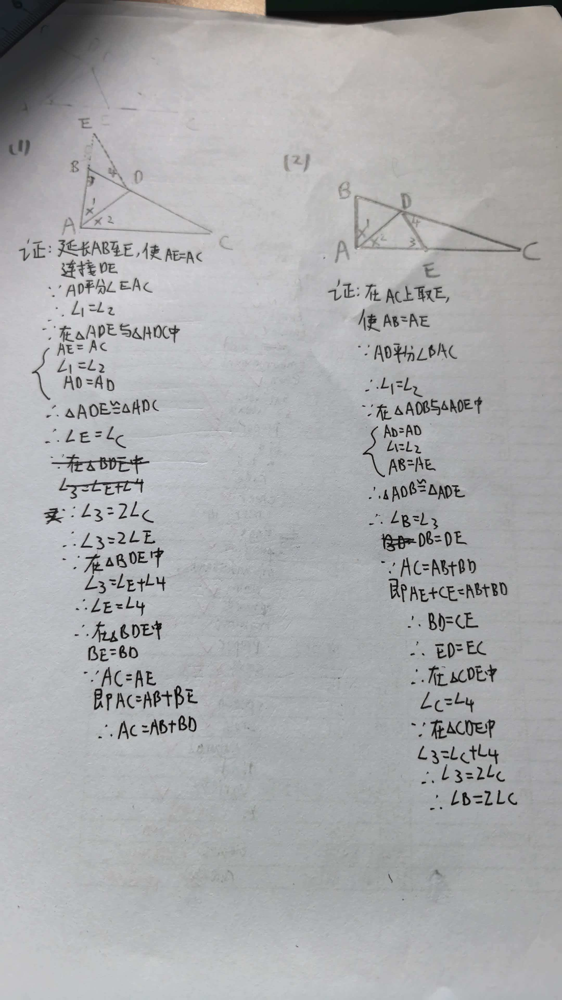

# 七年级几何难题精选
题目一：角平分线+等腰三角形模型
【背景】
已知：在△ABC中，∠BAC = 90°，∠B = 2∠C，AD平分∠BAC，交BC于点D。

【问题】
（1）求证：AB + BD = AC。

（2）如图，在△ABC中，AD平分∠BAC，且AB + BD = AC，求证：∠B = 2∠C。

<<<<<<< Updated upstream
=======

---
>>>>>>> Stashed changes
