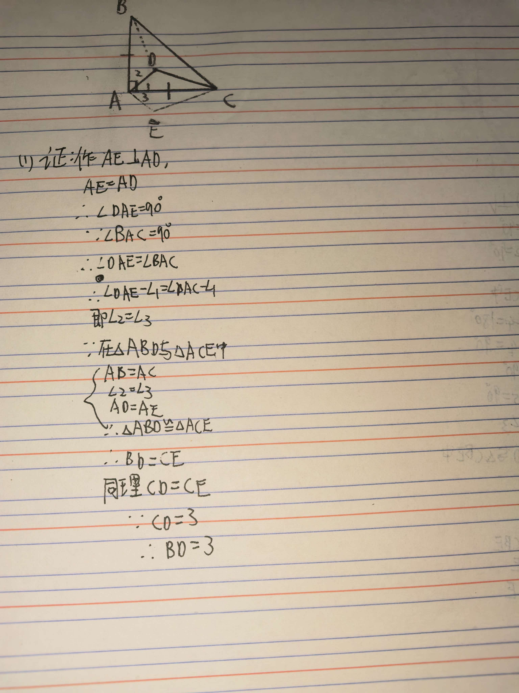
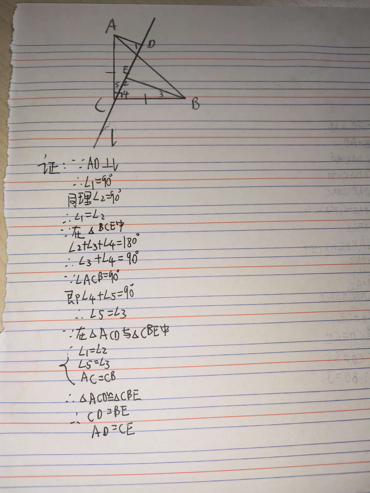

# 七年级几何难题精选
题目一：一线三垂直模型
【背景】
已知：在△ABC中，∠ACB = 90°，AC = BC，直线l经过点C，AD⊥l于点D，BE⊥l于点E。

【问题】
求证：CD = BE，AD = CE。

---

题目二：旋转模型（构造全等）
【背景】
已知：在△ABC中，AB = AC，∠BAC = 90°，AD平分∠BAC

【问题】
如图，若AD = 2，CD = 3，求BD的长。
