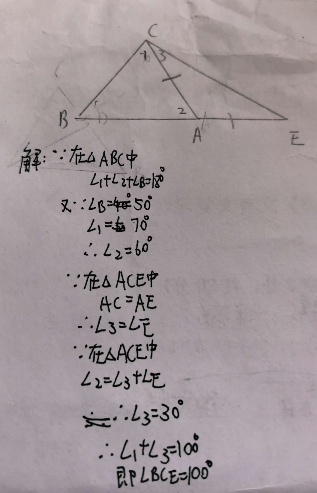
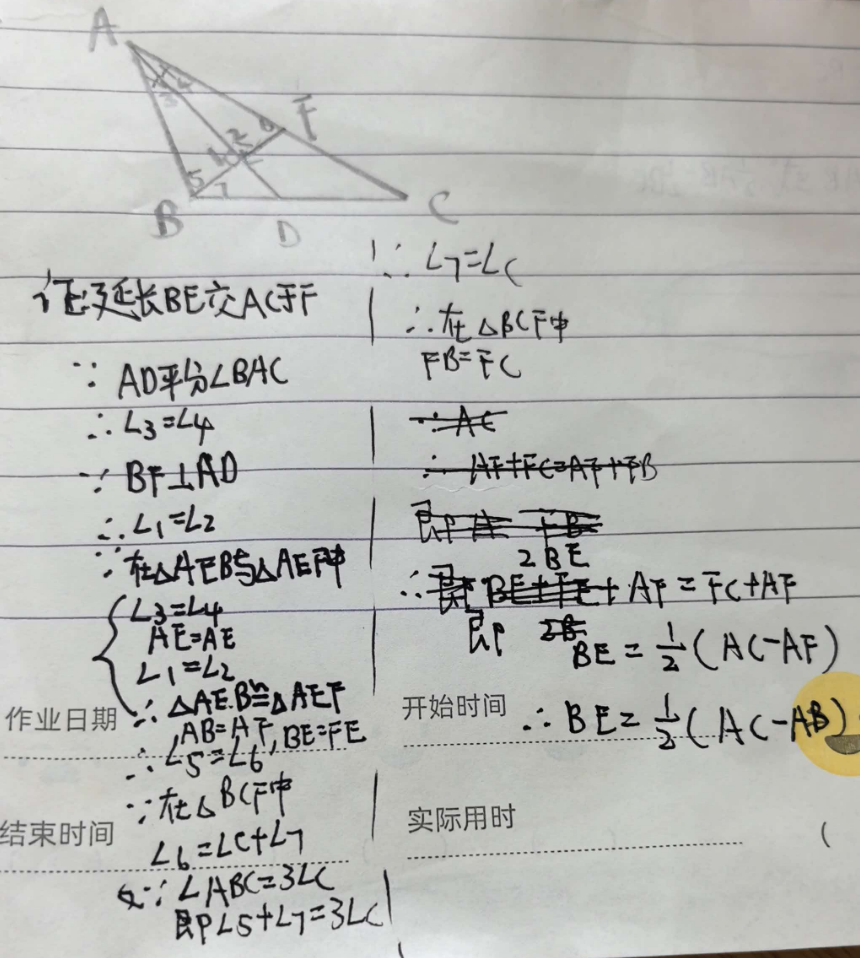

# 七年级几何难题精选
题目一：三角形外角模型
【背景】
已知：在△ABC中，∠B = 40°，∠C = 60°，AD是∠BAC的角平分线，交BC于点D。
【问题】
如图，在△ABC中，∠B = 50°，∠C = 70°，延长BA到点E，使AE = AC，连接CE，求∠BCE的度数。

---

题目二：角平分线+垂线构造模型
【背景】
已知：在△ABC中，∠B = 3∠C，AD是∠A的角平分线，BE⊥AD于点E。

【问题】
求证：BE = ½(AC - AB)。
