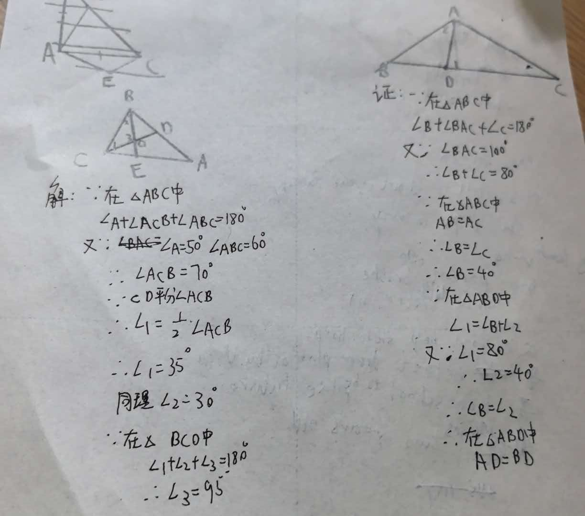

# 七年级几何难题精选

## 题目一：等腰三角形角度关系模型

【背景】
△ABC中，AB = AC，∠BAC = 100°，D是BC边上一点，∠ADC = 80°。

【问题】
求证：AD = BD

---

## 题目二：三角形角度计算难题

【背景】
△ABC中，∠BAC = 50°，∠ABC = 60°，BE平分∠ABC，CD平分∠ACB，BE与CD相交于点O。

【问题】
求∠BOC的度数

