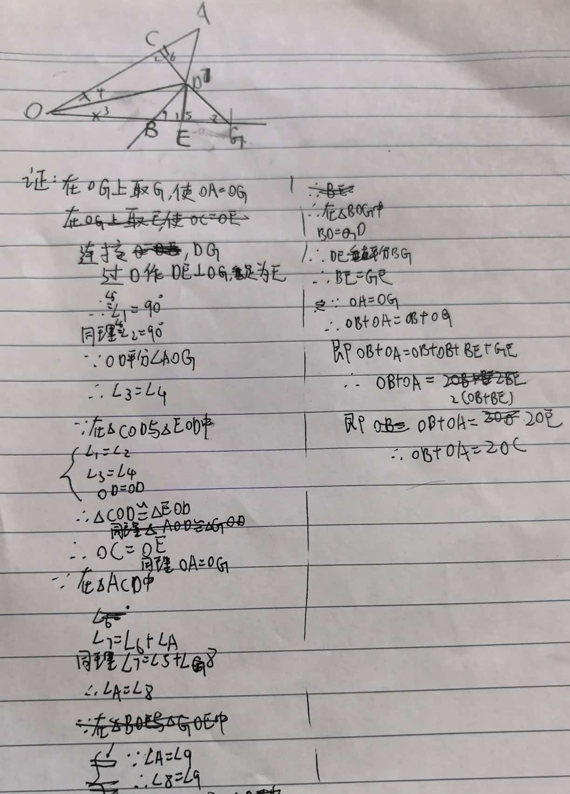
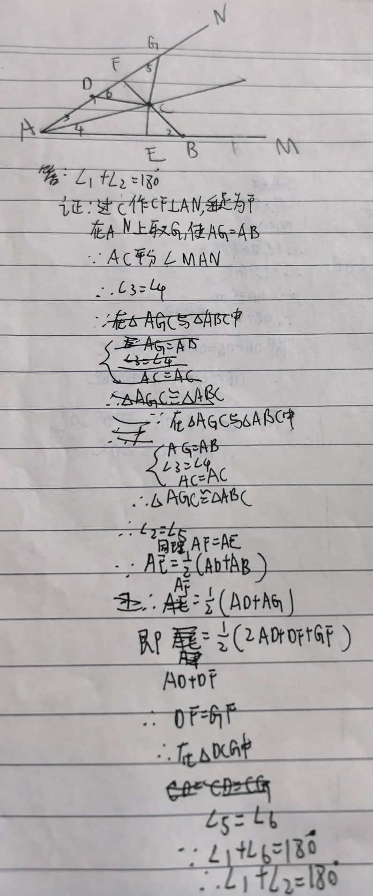

# 七年级几何难题精选

## 题目一：角平分线与垂线模型

【背景】
已知OD平分∠AOB，DC⊥OA于点C，∠A = ∠GBD。

【问题】
求证：AO + BO = 2CO

---

## 题目二：角平分线与线段关系模型

【背景】
已知点C是∠MAN的平分线上一点，CE⊥AB于E，B、D分别在AM、AN上，且AE = 1/2(AD + AB)。

【问题】
问：∠1和∠2有何关系？

---
